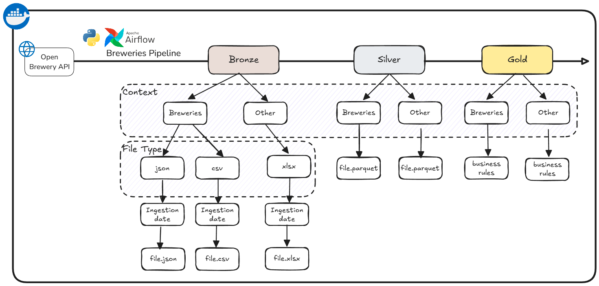

# AbInbev: BEES Data Engineering – Breweries Case



## Design Choices
- Medallion Architecture: Data is stored in three layers (Bronze, Silver, Gold) for better organization and scalability.
- Apache Airflow: Used for orchestration due to its robust scheduling, monitoring, and error-handling capabilities. Airflow allows for easy retries, task dependencies, and pipeline visualization. Provides a user-friendly UI for monitoring pipeline runs and logs.
- Modularity: The project is organized into separate scripts for fetching, transforming, and aggregating data, making it easy to maintain and extend.
- Containerization: Docker is used to containerize the application, ensuring consistency across environments and simplifying deployment.

- Pandas was used due to the small dataset size, being sufficient to process this amount of data and also used due to ease of containerization and integration with airflow. PySpark was used in other versions (see not merged branches), running well locally but presenting some incompatibilities when containerized together with airflow.

- To test data processing steps, pytest was used due to the familiarity.

### Flow Description
- First, the data is ingested from Breweries API and saved "as is" at the Bronze layer;
- The data is structured and cleaned, removing undesired or redundant columns (e.g. adress_1, adress_2 and adress_3) and saved at the Silver layer.
- Finnaly, business rules were applied (for breweries data, aggregations by city and stante) and the data is saved at Gold layer, able to consumption.

## Project Structure
```
ABINBEV_DATA_ENG/
├── dags/                  # Airflow DAGs
│   └── breweries_pipeline.py
├── data/                  # Data lake, medallion architecture (Bronze, Silver, Gold layers will be stored here)
├── logs/                  # Airflow logs
├── tasks/                 # ETL task scripts
│   ├── __init__.py        
│   ├── bronze_to_silver.py
│   ├── data_ingestion.py
│   ├── silver_to_gold.py
├── tests/                 # Test cases
├── .env                   # Environment variables
├── .gitignore             # Git ignore file
├── docker-compose.yml     # Docker Compose configuration
├── Dockerfile             # Docker image definition
├── main.py                # For local testing
├── README.md              # Documentation
└── requirements.txt       # Python dependencies
```

## How to run it
- Install docker desktop: https://www.docker.com/get-started/
- Run command **{ docker-compose up --build }** from the root folder
- Access Airflow UI at http://localhost:8080/
    - User: airflow
    - Pswd: airflow
- Enable breweries pipeline trigger (by default, the pipeline trigger will be off at airflow first setup)


## Future Improvements
As a timebox project, I focused on providing a baseline version that, of course, can be improved later by:

- Implement Spark utilisation for handling large datasets
- Implement Delta Lake at Gold layer to anble ACID transactions and trackability
- Implement Airflow alerts sending (Slack, Teams, email)
- Create SQL views/materialized views from Gold layer to facilitate processed data consumption
- Structure code and data lake to receive other contexts
- Increase test cases and coverage

## Support material used
- https://www.openbrewerydb.org/documentation
- https://airflow.apache.org/docs/apache-airflow/2.10.0/installation/prerequisites.html
- https://airflow.apache.org/docs/apache-airflow/stable/docker-compose.yaml


